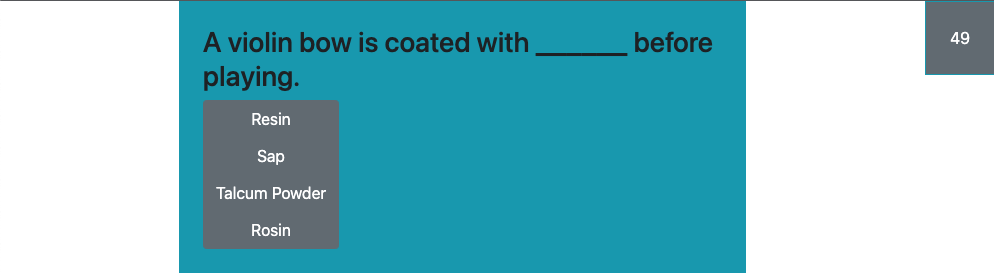
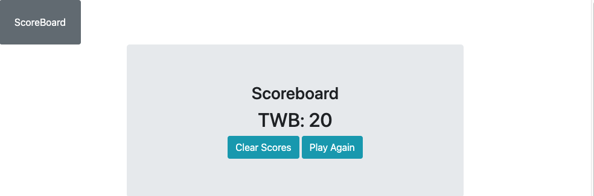

# MUSIC QUIZ

## A seven-question quiz about music and instruments

[Try it out HERE!](https://tbro4.github.io/code-quiz/)

When loading, user is presented with a start screen. Top left is a button to view the scoreboard (locally stored stats). Top right is a timer displaying 60.

When they click "Start Quiz" the first question appears. It is populated randomly from an array of Q&As.

Each time they click an answer a new question is presented.

The game ends and the enter initials screen displays when the clock runs out, or they have answered all the questions.

They may enter their initials and upon clicking "Submit", they are taken to the scoreboard with button options to "Clear Scores" or "Play Again"

